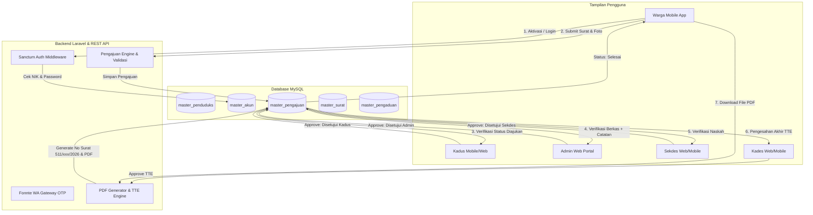

# MANUAL BOOK
# SISTEM INFORMASI DESA RAMBIPUJI

**Panduan Penggunaan Aplikasi Mobile dan Website Desa Rambipuji**

* **Nama Sistem**: Digital Village — Sistem Informasi & Pelayanan Digital Desa Rambipuji
* **Versi Dokumentasi**: 1.0.0
* **Tahun**: 2026
* **Teknologi Utama**: Flutter (Mobile Android), Laravel 10 (Web Portal & RESTful API), MySQL Database, Sanctum Authentication, Fonnte WhatsApp Gateway.

---

## DAFTAR ISI

1. [Bab 1 – Pendahuluan](#bab-1--pendahuluan)
   - 1.1 Tentang Sistem
   - 1.2 Tujuan Sistem
   - 1.3 Ruang Lingkup
   - 1.4 Persyaratan Sistem
2. [Bab 2 – Arsitektur Sistem](#bab-2--arsitektur-sistem)
   - 2.1 Skema Komunikasi Multi-Tier
   - 2.2 Hubungan Flutter, API, Backend Laravel, dan Database
3. [Bab 3 – Panduan Aplikasi Mobile (Warga & Perangkat Desa)](#bab-3--panduan-aplikasi-mobile)
   - 3.1 Instalasi Aplikasi Android
   - 3.2 Membuka Aplikasi & Onboarding
   - 3.3 Registrasi & Aktivasi Akun Warga
   - 3.4 Login Multi-Role (Warga, Kadus, Sekdes, Kades)
   - 3.5 Dashboard Warga & Menu Utama
   - 3.6 Pengelolaan Profil Warga
   - 3.7 Layanan Surat & Katalog Jenis Surat
   - 3.8 Pengajuan Surat Online & Unggah Berkas
   - 3.9 Pemantauan Status Pengajuan & Unduh Surat PDF
   - 3.10 Pengaduan Masyarakat (Buat & Monitoring Feedback)
   - 3.11 Fitur Notifikasi Real-time
   - 3.12 Fitur Khusus Mobile Perangkat Desa (Kadus, Sekdes, Kades)
   - 3.13 Prosedur Logout
4. [Bab 4 – Panduan Website Desa (Admin & Eksekutif)](#bab-4--panduan-website-desa)
   - 4.1 Portal Website & Login Admin / Perangkat Desa
   - 4.2 Dashboard Administrator & Ringkasan Statistik
   - 4.3 Manajemen Data Penduduk & Kartu Keluarga (KK)
   - 4.4 Manajemen Akun Kepala Dusun
   - 4.5 Manajemen Master Surat & Syarat Persyaratan
   - 4.6 Pengelolaan Pengajuan Surat (Verifikasi Multi-Tier)
   - 4.7 Tambah Pengajuan Surat atas Nama Warga
   - 4.8 Pengolahan Surat Selesai & Tanda Tangan Elektronik (TTE) Kades
   - 4.9 Pengolahan Surat Ditolak & Catatan Penolakan
   - 4.10 Manajemen Pengaduan Masyarakat & Tanggapan / Feedback
   - 4.11 Kelola Website & Konten Landing Page Portal Desa
5. [Bab 5 – Panduan Penggunaan Berdasarkan Role](#bab-5--panduan-berdasarkan-role)
   - 5.1 Panduan Role Warga / Masyarakat (Level 5)
   - 5.2 Panduan Role Admin Desa (Level 1)
   - 5.3 Panduan Role Kepala Dusun / Kadus (Level 2)
   - 5.4 Panduan Role Sekretaris Desa / Sekdes (Level 3)
   - 5.5 Panduan Role Kepala Desa / Kades (Level 4)
6. [Bab 6 – Panduan Khusus Pengajuan Surat](#bab-6--panduan-khusus-pengajuan-surat)
   - 6.1 Memilih Jenis Surat
   - 6.2 Mengisi Formulir & Data Otomatis Warga
   - 6.3 Mengunggah Berkas Persyaratan & Foto Bukti Lampiran
   - 6.4 Mengirimkan Pengajuan Surat
   - 6.5 Alur Verifikasi & Persetujuan Berjenjang (Kadus -> Admin -> Sekdes -> Kades TTE)
   - 6.6 Penerbitan Nomor Surat Keluar Otomatis & File PDF Resmi
   - 6.7 Mengunduh dan Mencetak Dokumen Surat Selesai
7. [Bab 7 – Alur Administrasi Persuratan Sistem](#bab-7--alur-administrasi)
8. [Bab 8 – Troubleshooting & Penyelesaian Masalah](#bab-8--troubleshooting)
9. [Bab 9 – FAQ (Frequently Asked Questions)](#bab-9--faq)
10. [Bab 10 – Penutup](#bab-10--penutup)
11. [Lampiran A – Ringkasan Fitur Sistem](#lampiran-a--ringkasan-fitur)
12. [Lampiran B – Matriks Hak Akses Pengguna (Role Matrix)](#lampiran-b--matriks-hak-akses)
13. [Lampiran C – Diagram Alur Persuratan & Data Sistem](#lampiran-c--diagram-alur-sistem)

---

# BAB 1 – PENDAHULUAN

## 1.1 Tentang Sistem
**Sistem Informasi Desa Rambipuji (Digital Village)** adalah platform pelayanan publik berbasis teknologi informasi terpadu yang dirancang khusus untuk Pemerintah Desa Rambipuji, Kabupaten Jember. Sistem ini mengintegrasikan layanan administrasi persuratan publik, pengaduan masyarakat, serta tata kelola data kependudukan dalam satu ekosistem digital yang dapat diakses melalui **Aplikasi Mobile Android** oleh warga/perangkat desa dan **Website Portal** oleh jajaran administrator serta eksekutif desa.

## 1.2 Tujuan Sistem
1. **Mempermudah Akses Pelayanan Persuratan**: Memungkinkan warga mengajukan surat keterangan/pengantar kapan saja dan di mana saja tanpa perlu mengantre secara fisik di Kantor Desa.
2. **Transparansi & Akuntabilitas**: Memberikan transparansi status pengajuan surat secara real-time dari verifikasi tingkat Kepala Dusun hingga pengesahan Kepala Desa.
3. **Pengaduan Masyarakat Terintegrasi**: Menyediakan saluran resmi penyampaian aspirasi, laporan fasilitas umum, masalah lingkungan, maupun keamanan desa.
4. **Efisiensi Kerja Perangkat Desa**: Mengotomatisasi penomoran surat keluar resmi, verifikasi berjenjang, pembuatan file PDF, dan integrasi Tanda Tangan Elektronik (TTE) Kepala Desa.

## 1.3 Ruang Lingkup
- **Aplikasi Mobile (Android - Flutter)**: Ditujukan bagi warga desa untuk aktivasi akun, login, pengajuan surat, pengecekan status, pengaduan masyarakat, notifikasi, serta pemantauan tugas khusus bagi Perangkat Desa (Kadus, Sekdes, Kades).
- **Website Desa (Laravel Web)**: Ditujukan bagi Admin Desa, Kepala Dusun, Sekretaris Desa, dan Kepala Desa untuk manajemen data penduduk, kartu keluarga, verifikasi surat masuk, penerbitan surat selesai, penolakan surat, balasan pengaduan, dan pengelolaan portal berita/halaman utama desa.
- **Backend Service & RESTful API**: Jalur integrasi data antara database pusat MySQL dan aplikasi mobile dengan autentikasi keamanan Sanctum Token & Otp WhatsApp Gateway.

## 1.4 Persyaratan Sistem

### A. Persyaratan Aplikasi Mobile (Android)
- **Sistem Operasi**: Android 7.0 (Nougat) atau versi yang lebih baru.
- **Koneksi Internet**: Minimal jaringan 3G / 4G / Wi-Fi stabil.
- **Kamera / Galeri**: Diperlukan izin akses kamera dan penyimpanan file untuk mengunggah foto berkas persyaratan dan foto pengaduan.
- **Ukuran Aplikasi**: ~25 MB - 40 MB.

### B. Persyaratan Website Desa (Web Browser)
- **Perangkat**: Komputer PC, Laptop, atau Tablet.
- **Web Browser**: Google Chrome (versi 90+), Mozilla Firefox (versi 88+), Microsoft Edge, atau Safari.
- **Resolusi Layar**: Minimal 1280 x 720 piksel (Disarankan Full HD 1920 x 1080 untuk kenyamanan dashboard).
- **Koneksi Internet**: Minimal 5 Mbps.

---

# BAB 2 – ARSITEKTUR SISTEM

## 2.1 Skema Komunikasi Multi-Tier
Sistem Informasi Desa Rambipuji menggunakan arsitektur **Client-Server RESTful API Multi-Tier** yang memisahkan lapisan tampilan (UI), logika bisnis (Backend), dan penyimpanan data (Database).

```text
[ Warga / Perangkat Desa ]          [ Admin / Eksekutif Desa ]
    (Mobile App - Flutter)               (Portal Web Browser)
              │                                   │
              ▼                                   ▼
      HTTP / JSON API                       HTTP / Blade View
  (Laravel Sanctum Token)               (Web Middleware Auth & Role)
              │                                   │
              └───────────────┬───────────────────┘
                              │
                              ▼
                [ Backend Engine: Laravel 10 ]
             (Controllers, Models, Middleware)
                              │
               ┌──────────────┴──────────────┐
               ▼                             ▼
       [ Database MySQL ]          [ Service Eksternal ]
     (Tabel Penduduk, KK,        (WhatsApp OTP Gateway Fonnte,
    Surat, Pengajuan, Account)    PDF Generator, Storage Files)
```

## 2.2 Hubungan Flutter, API, Backend Laravel, dan Database
1. **Aplikasi Mobile (Flutter)** melakukan komunikasi data melalui RESTful API menggunakan HTTP Client dengan format data JSON.
2. **Autentikasi Keamanan**: Setiap permintaan data terlindungi menggunakan Bearer Sanctum Token yang didapat saat login.
3. **Backend Laravel**: Memproses validasi data, aturan bisnis persuratan, pengolahan berkas lampiran, penomoran otomatis surat keluar, dan pengubahan status persetujuan.
4. **Database MySQL**: Menyimpan data relasional master penduduk, master kartu keluarga, data pengajuan surat, pengaduan, notifikasi, dan akun pengguna.

---

# BAB 3 – PANDUAN APLIKASI MOBILE

## 3.1 Instalasi Aplikasi Android
1. Unduh berkas `digital_village_rambipuji.apk` dari link resmi yang disediakan oleh Pemerintah Desa Rambipuji.
2. Jalankan instalasi APK di perangkat Android Anda. Jika muncul peringatan *"Install from unknown sources"* (Sumber tidak dikenal), masuk ke **Pengaturan HP > Keamanan > Izinkan Instalasi Aplikasi dari Sumber Tidak Dikenal**.
3. Buka aplikasi setelah proses instalasi selesai.

## 3.2 Membuka Aplikasi & Onboarding
Saat aplikasi pertama kali dibuka, sistem menampilkan **Splash Screen** dengan Logo Desa Rambipuji dan animasi identitas *Digital Village*. Jika pengguna belum login, sistem akan mengarahkan ke halaman **Pilihan Akses Utama**.

## 3.3 Registrasi & Aktivasi Akun Warga
Fitur ini digunakan oleh warga yang NIK-nya sudah terdaftar dalam Sistem Data Penduduk Desa Rambipuji tetapi belum memiliki akun aktif di aplikasi mobile.

### Langkah Aktivasi Akun Warga:
1. Buka aplikasi, lalu pilih tombol **"Daftar / Aktivasi Akun"**.
2. Masukkan data yang diminta:
   - **NIK**: 16 digit Nomor Induk Kependudukan (Sesuai KTP/KK).
   - **Email**: Alamat email aktif.
   - **Nomor HP**: Nomor telepon/WhatsApp aktif (Minimal 10 digit).
   - **Password**: Minimal 8 karakter, wajib kombinasi huruf besar, huruf kecil, dan angka.
3. Tekan tombol **"Aktivasi Akun"**.
4. **Hasil**: Apabila NIK terdaftar dan belum pernah aktif, akun berhasil dibuat dan pengguna langsung diarahkan ke halaman Login.

> **Catatan Validasi**: Jika NIK tidak terdaftar di database desa, sistem akan menampilkan pesan: *"NIK tidak ditemukan dalam data penduduk"*. Silakan hubungi Kantor Desa untuk pendataan NIK terlebih dahulu.

## 3.4 Login Multi-Role
Aplikasi mobile mendukung login untuk role **Warga (Level 5)**, **Kepala Dusun (Level 2)**, **Sekretaris Desa (Level 3)**, dan **Kepala Desa (Level 4)**.

### Langkah Login:
1. Pilih tombol **"Masuk / Login"**.
2. Masukkan **NIK / Email** dan **Password**.
3. Tekan tombol **"LOGIN"**.
4. Sistem akan mendeteksi tingkat akses (*level/role*) akun pengguna:
   - **Admin Desa (Level 1)**: Ditolak oleh sistem mobile dengan pesan: *"Akun Admin Desa hanya dapat diakses melalui portal Website Desa."*
   - **Role Lain (Warga / Kadus / Sekdes / Kades)**: Berhasil login dan masuk ke tampilan Dashboard sesuai role masing-masing.

### Lupa Password via WhatsApp OTP:
1. Tekan tombol **"Lupa Password?"** pada halaman login.
2. Masukkan **Nomor HP / WhatsApp** yang terdaftar di akun.
3. Tekan tombol **"Kirim Kode OTP"**.
4. Kode OTP 6 digit akan dikirimkan secara otomatis via WhatsApp melalui Fonnte Gateway (Berlaku selama 10 menit).
5. Masukkan Kode OTP pada halaman **Verifikasi OTP**.
6. Masukkan Password Baru dan Konfirmasi Password Baru, lalu tekan **"Reset Password"**.

## 3.5 Dashboard Warga & Menu Utama
Tampilan Dashboard Warga (*HomeScreen*) dirancang modern dan bersih dengan komponen utama:
- **Header Selamat Datang**: Menampilkan Foto Profil Warga, Nama Lengkap, Tanggal Hari Ini, Nama Desa, dan Icon Notifikasi.
- **Card Ringkasan Status Layanan Surat**:
  - **Surat Diproses**: Jumlah pengajuan surat yang sedang berstatus *Diajukan* / *Disetujui Kepala Dusun* / *Disetujui Admin* / *Disetujui Sekdes*.
  - **Surat Selesai**: Jumlah pengajuan surat yang telah disetujui Kepala Desa dan siap diunduh PDF-nya.
- **Card Pengaduan Masyarakat**: Pintasan cepat untuk membuat pengaduan baru atau melihat riwayat pengaduan.
- **Card Ringkasan Aktivitas**: Total akumulasi Surat, Surat Selesai, dan Total Pengaduan Warga.
- **Bottom Navigation Bar**: Navigasi bawah untuk berpindah ke menu **Beranda (Home)**, **Layanan Surat**, **Pengaduan**, **Status Pengajuan**, dan **Profil**.

## 3.6 Pengelolaan Profil Warga
1. Akses menu **Profil** dari Bottom Navigation Bar atau tap foto profil di header.
2. **Detail Profil**: Menampilkan NIK, Nama Lengkap, No. KK, Tanggal Lahir, Jenis Kelamin, Alamat, RT/RW, Dusun, Status Perkawinan, dan Pekerjaan.
3. **Ubah Foto Profil**: Tap icon pensil di dekat foto profil, pilih foto dari galeri HP, lalu tekan **"Simpan Foto"**.
4. **Ubah Data Kontak**: Pengguna dapat memperbarui Email dan Nomor HP mandiri.

## 3.7 Layanan Surat & Katalog Jenis Surat
1. Akses menu **Surat** pada navigasi bawah.
2. Sistem menampilkan daftar lengkap jenis pelayanan surat keterangan desa yang tersedia, antara lain:
   - **Surat Keterangan Usaha (SKU)**
   - **Surat Keterangan Tidak Mampu (SKTM)**
   - **Surat Keterangan Domisili**
   - **Surat Pengantar SKCK**
   - **Surat Keterangan Kematian**
3. Setiap kartu jenis surat dilengkapi dengan daftar berkas persyaratan yang wajib dipersiapkan sebelum pengajuan.

## 3.8 Pengajuan Surat Online & Unggah Berkas
1. Pilih jenis surat yang diinginkan dari Katalog Layanan Surat.
2. Halaman **Form Pengajuan Surat** akan terbuka.
3. **Data Warga**: Terisi secara otomatis (*Auto-fill*) dari database kependudukan NIK pengguna (No KK, NIK, Nama, Tempat/Tgl Lahir, JK, Alamat, RT, RW).
4. **Keterangan / Keperluan**: Isi kolom keperluan pengajuan surat (misal: *"Untuk persyaratan pendaftaran beasiswa"* atau *"Untuk kelengkapan administrasi bank"*).
5. **Unggah Berkas Persyaratan**: Tap pada kolom foto berkas yang disyaratkan (misal: Foto KTP, Foto KK) untuk memilih gambar dari galeri HP.
6. **Foto Bukti Lampiran (Opsional/Tambahan)**: Tekan **"Tambah Foto"** jika ada dokumen pendukung tambahan.
7. Tekan tombol **"Kirim Pengajuan"**.
8. **Hasil**: Pengajuan surat terkirim ke sistem dengan status awal **"Diajukan"**.

## 3.9 Pemantauan Status Pengajuan & Unduh Surat PDF
1. Akses menu **Status** dari navigasi bawah.
2. Terdapat 3 Tab Status Pengajuan:
   - **Diajukan**: Menampilkan daftar surat yang sedang dalam tahap proses verifikasi oleh perangkat desa (Kadus, Admin, Sekdes, Kades). Pengguna dapat membatalkan/menghapus pengajuan pada tahap ini jika ada kesalahan.
   - **Ditolak**: Menampilkan pengajuan surat yang ditolak oleh petugas beserta **Catatan / Alasan Penolakan** (misal: *"Foto KTP buram/tidak terbaca"*).
   - **Selesai**: Menampilkan pengajuan surat yang telah disetujui Kepala Desa dan diterbitkan Surat Keluar Resminya.
3. **Unduh PDF Surat**: Pada tab *Selesai*, tekan tombol **"Cetak / Unduh PDF"** untuk mengunduh dokumen resmi surat ber-TTD Digital Kepala Desa langsung ke penyimpanan HP Anda.

## 3.10 Pengaduan Masyarakat
Warga dapat melaporkan keluhan, pengaduan fasilitas umum, kebersihan lingkungan, atau masalah pelayanan desa.

### A. Buat Pengaduan Baru:
1. Akses menu **Pengaduan** dari beranda atau tab menu.
2. Pilih **Kategori Pengaduan**:
   - *Infrastruktur* (Jalan rusak, penerangan jalan, saluran air)
   - *Pelayanan* (Layanan kantor desa)
   - *Keamanan* (Gangguan ketertiban)
   - *Lingkungan* (Sampah, banjir)
   - *Lainnya*
3. Isi **Uraian Pengaduan**: Jelaskan detail permasalahan secara rinci.
4. **Foto Pendukung (Opsional)**: Unggah foto bukti kondisi di lapangan.
5. Tekan **"Kirim Pengaduan"**.

### B. Riwayat & Tanggapan Pengaduan:
1. Buka menu **Riwayat Pengaduan**.
2. Pengguna dapat melihat daftar laporan yang pernah dikirimkan beserta status tanggapannya:
   - *Menunggu Tanggapan*: Pengaduan baru terkirim, belum dibalas Admin.
   - *Ditanggapi*: Admin Desa telah memberikan balasan/solusi atas laporan tersebut.
3. Pengguna dapat mengedit atau menghapus pengaduan yang belum dibalas.

## 3.11 Fitur Notifikasi Real-time
1. Tap icon **Lonceng Notifikasi** di pojok kanan atas Dashboard.
2. Menampilkan pemberitahuan otomatis setiap kali terjadi perubahan status pada pengajuan surat (misal: *"Surat SKU Anda telah disetujui oleh Kepala Dusun"* atau *"Surat Anda telah Selesai dan siap diunduh"*).
3. Pengguna dapat menandai notifikasi sebagai telah dibaca (*Mark as Read*).

## 3.12 Fitur Khusus Mobile Perangkat Desa

### A. Kepala Dusun (Kadus Mobile):
- **Kadus Dashboard**: Menampilkan statistik pengajuan warga di dusunnya.
- **Data Penduduk & KK Dusun**: Melihat daftar Kartu Keluarga dan Anggota Keluarga khusus di wilayah dusun yang dipimpinnya.
- **Persetujuan Surat Masuk Dusun**: Memeriksa pengajuan surat dari warga dusunnya, melakukan Persetujuan (*Approve*) atau Penolakan (*Reject* dengan alasan).
- **Tambah Pengajuan Langsung**: Kadus dapat mendaftarkan pengajuan surat atas nama warga di dusunnya secara langsung.

### B. Sekretaris Desa (Sekdes Mobile):
- **Sekdes Dashboard**: Ringkasan monitoring persuratan desa.
- **Verifikasi Persuratan Sekdes**: Memeriksa surat yang sudah disetujui Admin/Kadus, lalu memberikan persetujuan untuk diteruskan ke Kepala Desa.
- **Monitoring Pengaduan**: Melihat daftar pengaduan warga secara *read-only*.

### C. Kepala Desa (Kades Mobile):
- **Kades Dashboard Eksekutif**: Ringkasan statistik eksekutif desa.
- **Persetujuan Akhir (TTE Digital)**: Memeriksa surat yang disetujui Sekdes, menyetujui pengajuan dengan pembentukan Nomor Surat Resmi & TTD Digital, serta mengubah status menjadi **Selesai**.

## 3.13 Prosedur Logout
1. Masuk ke menu **Profil**.
2. Gulir ke bagian paling bawah, lalu tekan tombol **"Keluar / Logout"**.
3. Konfirmasi dialog keluar. Token autentikasi di HP akan dihapus secara aman.

---

# BAB 4 – PANDUAN WEBSITE DESA

## 4.1 Portal Website & Login Admin / Perangkat Desa
1. Buka web browser di komputer/laptop, lalu akses URL Portal Desa Rambipuji (misal: `https://desarambipuji-jember.com` atau `http://localhost/project-desa-rambipuji/public`).
2. Masukkan alamat URL login: `/login`.
3. Masukkan **NIK / Email** dan **Password** pengguna.
4. Tekan **"Login"**.
5. Sistem akan memeriksa hak akses pengguna dan mengarahkan ke Dashboard sesuai Role:
   - **Level 1**: Administrator Desa (`/admin/dashboard`)
   - **Level 2**: Kepala Dusun (`/kepaladusun/dashboard`)
   - **Level 3**: Sekretaris Desa (`/sekretarisdesa/dashboard`)
   - **Level 4**: Kepala Desa (`/kepaladesa/dashboard`)

## 4.2 Dashboard Administrator & Ringkasan Statistik
Tampilan Dashboard Administrator menyajikan visualisasi data dan statistik utama:
- Widget Kartu Jumlah Data Penduduk, Kartu Keluarga, Pengajuan Surat Masuk, Surat Selesai, Surat Ditolak, dan Pengaduan Masyarakat.
- Grafik tren pengajuan surat bulanan dan statistik kependudukan per dusun.

## 4.3 Manajemen Data Penduduk & Kartu Keluarga (KK)
Akses melalui menu sidebar: **Master Penduduk** (`/admin/master_kartukeluarga`).

### A. Pengelolaan Data Kartu Keluarga (KK):
- **Tambah Data KK**: Tekan tombol **"Tambah Data KK"**, isi No. KK, Nama Kepala Keluarga, Alamat, RT, RW, dan Dusun.
- **Import Excel KK**: Tekan tombol **"Import Excel"**, unggah berkas Excel `.xlsx` format data KK sesuai template, lalu tekan **"Proses Import"**.
- **Edit & Hapus KK**: Gunakan icon aksi pada tabel untuk memperbarui atau menghapus data KK.

### B. Pengelolaan Data Anggota Penduduk:
- Tekan tombol **"Detail / Anggota KK"** pada baris Kartu Keluarga.
- **Tambah Penduduk**: Isi NIK, Nama Lengkap, Tempat Tgl Lahir, Jenis Kelamin, Agama, Pendidikan, Pekerjaan, Status Perkawinan, Status Hubungan Keluarga, dan Nama Orang Tua.
- **Edit & Hapus Penduduk**: Memperbarui informasi biodata penduduk atau menghapus data penduduk yang pindah/meninggal.

## 4.4 Manajemen Akun Kepala Dusun
Akses melalui menu sidebar: **Akun Kepala Dusun** (`/admin/akunkadus`).
- Admin Desa dapat mendaftarkan akun login untuk Kepala Dusun di setiap wilayah dusun Rambipuji.
- **Input Form**: Pilih NIK Kepala Dusun, No HP, Email, Dusun Wilayah Tugas, dan Password.
- Admin dapat memperbarui data akun atau mereset password akun Kadus jika diperlukan.

## 4.5 Manajemen Master Surat & Syarat Persyaratan
Akses melalui menu sidebar: **Master Surat** (`/admin/mastersurat`).
- **Tambah Jenis Surat Baru**: Masukkan Nama Surat (contoh: *Surat Keterangan Usaha*), Kode/Slug Surat, Keterangan, dan tentukan **Daftar Berkas Persyaratan** (misal: Berkas 1 = KTP, Berkas 2 = KK, Berkas 3 = Foto Tempat Usaha).
- **Edit / Hapus Jenis Surat**: Mengubah syarat dokumen atau menonaktifkan jenis surat tertentu.

## 4.6 Pengelolaan Pengajuan Surat (Verifikasi Multi-Tier)
Akses melalui menu sidebar: **Pengajuan Surat > Surat Masuk** (`/admin/suratmasuk`).

### Langkah Verifikasi Surat Masuk oleh Admin Desa:
1. Pilih menu **Surat Masuk**. Tabel menampilkan daftar pengajuan warga yang berstatus *Disetujui Kepala Dusun* atau *Diajukan*.
2. Tekan icon **"Detail / Verifikasi"** pada baris pengajuan.
3. Periksa kelengkapan isi formulir, NIK warga, serta foto berkas persyaratan yang diunggah.
4. **Persetujuan Admin**:
   - Isi kolom wajib: **Keterangan Verifikasi Admin** (contoh: *"Berkas fisik lengkap dan tervalidasi"*).
   - Tekan tombol **"Setujui & Teruskan ke Sekdes"**.
   - Status pengajuan berubah menjadi **"Disetujui Admin"**.
5. **Penolakan Admin**:
   - Tekan tombol **"Tolak"**.
   - Isi kolom wajib: **Alasan Penolakan** (contoh: *"Foto KK tidak jelas, mohon upload ulang"*).
   - Status pengajuan berubah menjadi **"Ditolak"**.

## 4.7 Tambah Pengajuan Surat atas Nama Warga
Akses melalui menu sidebar: **Pengajuan Surat > Tambah Pengajuan** (`/admin/tambah-pengajuan`).
- Fitur ini digunakan apabila ada warga awam yang datang langsung ke Kantor Desa tanpa menggunakan aplikasi mobile.
- **Langkah**:
  1. Cari & Pilih NIK / Nama Penduduk dari dropdown pencarian.
  2. Pilih Jenis Surat yang diajukan.
  3. Isi Keperluan Surat.
  4. Unggah berkas fisik yang dibawa warga (scan/foto).
  5. Tekan **"Simpan Pengajuan"**. Pengajuan akan masuk ke sistem secara otomatis.

## 4.8 Pengolahan Surat Selesai & Tanda Tangan Elektronik (TTE) Kades
Akses melalui role **Kepala Desa** (`/kepaladesa/suratmasuk`).

### Langkah Pengesahan Surat oleh Kepala Desa:
1. Kepala Desa login ke Web Portal (`/kepaladesa/dashboard`).
2. Masuk ke menu **Persetujuan Surat (TTE) > Surat Masuk**.
3. Sistem menampilkan pengajuan berstatus **"Disetujui Sekretaris Desa"**.
4. Kades meninjau berkas, lalu menekan tombol **"Setujui & Sahkan (TTE)"**.
5. **Eksekusi Otomatis Sistem**:
   - Sistem menetapkan **Nomor Surat Keluar Resmi** dengan format otomatis: `511/{Nomor_Urut}/35.09.13.2006/{Tahun}` (Nomor urut otomatis reset setiap pergantian tahun).
   - Sistem menyematkan stempel & Tanda Tangan Digital Kepala Desa.
   - Generasi otomatis dokumen berkas PDF Surat Selesai.
   - Status pengajuan berubah menjadi **"Selesai"**.
6. Surat yang telah selesai dapat dipantau di menu **Surat Selesai** (`/admin/suratselesai`) dan dapat diunduh/dicetak oleh Admin maupun Warga di aplikasi mobile.

## 4.9 Pengolahan Surat Ditolak & Catatan Penolakan
Akses melalui menu: **Pengajuan Surat > Surat Ditolak** (`/admin/suratditolak`).
- Menampilkan seluruh riwayat pengajuan surat yang mengalami penolakan di tingkat Kadus, Admin, Sekdes, maupun Kades.
- Menyajikan detail tanggal penolakan, penolak, dan alasan penolakan untuk bahan evaluasi pelayanan.

## 4.10 Manajemen Pengaduan Masyarakat & Tanggapan / Feedback
Akses melalui menu sidebar: **Pengaduan Masyarakat** (`/admin/pengaduan`).
1. Admin Desa membuka daftar pengaduan masuk dari warga.
2. Pilih pengaduan yang ingin ditindaklanjuti, tekan tombol **"Detail / Tanggapi"**.
3. Tinjau ulasan pengaduan, kategori, dan foto lokasi/kejadian.
4. Isi kolom **Tanggapan / Feedback Admin** (contoh: *"Laporan telah diteruskan ke petugas kebersihan desa dan akan diperbaiki esok hari"*).
5. Tekan tombol **"Kirim Tanggapan"**.
6. Tanggapan akan langsung muncul di aplikasi mobile milik warga pelapor.

## 4.11 Kelola Website & Konten Landing Page Portal Desa
Akses melalui menu sidebar: **Kelola Website** (`/admin/landingpage`).
- Admin dapat mengedit tampilan Landing Page Portal Utama Desa Rambipuji (`/digital-village`):
  - Mengubah Foto Banner Hero Utama (*Hero Image*).
  - Mengubah Judul Sambutan & Deskripsi Profil Desa.
  - Mengunggah foto-foto galeri kegiatan desa.

---

# BAB 5 – PANDUAN BERDASARKAN ROLE

## 5.1 Panduan Role Warga / Masyarakat (Level 5)
- **Platform**: Aplikasi Mobile Android.
- **Tujuan**: Mengakses pelayanan persuratan publik dan menyampaikan pengaduan desa secara mandiri.
- **Hak Akses & Menu**:
  - Dashboard Warga & Ringkasan Aktivitas.
  - Aktivasi Akun, Login NIK, Reset Password via WA OTP.
  - Pengajuan Surat Online & Upload Berkas.
  - Pengecekan Status Pengajuan (Diajukan, Ditolak, Selesai).
  - Unduh File PDF Surat Selesai ber-TTD Digital.
  - Pengaduan Masyarakat (Kirim Laporan & Cek Tanggapan).
  - Notifikasi Real-time & Edit Profil Pribadi.

## 5.2 Panduan Role Admin Desa (Level 1)
- **Platform**: Portal Website Desa Rambipuji.
- **Tujuan**: Operator utama sistem, pengelola master data, serta verifikator persuratan tahap kedua.
- **Hak Akses & Menu**:
  - Dashboard Statistik Sistem.
  - CRUD & Import Data Penduduk serta Kartu Keluarga (KK).
  - Manajemen Akun Kepala Dusun per Wilayah.
  - Manajemen Master Jenis Surat & Persyaratan Berkas.
  - Verifikasi Surat Masuk (Persetujuan Admin + Catatan Verifikasi / Penolakan).
  - Input Pengajuan Surat Langsung atas Nama Warga.
  - Pengelolaan & Tanggapan Pengaduan Masyarakat.
  - Pengelolaan Tampilan Website & Landing Page Desa.

## 5.3 Panduan Role Kepala Dusun / Kadus (Level 2)
- **Platform**: Portal Website & Aplikasi Mobile.
- **Tujuan**: Verifikator awal pengajuan warga di wilayah dusunnya serta pendamping warga dusun.
- **Hak Akses & Menu**:
  - Dashboard Statistik Wilayah Dusun.
  - Pengecekan Data Penduduk & KK khusus Wilayah Dusun Tugasnya.
  - Verifikasi Tahap Pertama Surat Masuk Warga Dusun (Setuju / Tolak).
  - Input Pengajuan Surat Langsung untuk Warga Dusun.

## 5.4 Panduan Role Sekretaris Desa / Sekdes (Level 3)
- **Platform**: Portal Website & Aplikasi Mobile.
- **Tujuan**: Verifikator tingkat tiga yang membawahi keabsahan administrasi persuratan sebelum disahkan Kepala Desa.
- **Hak Akses & Menu**:
  - Dashboard Persuratan Desa.
  - Verifikasi Tahap Tiga Surat Masuk (Setuju diteruskan ke Kades / Tolak).
  - Master Penduduk (*View / Data Management*).
  - Monitoring Pengaduan Masyarakat (*Read-only*).

## 5.5 Panduan Role Kepala Desa / Kades (Level 4)
- **Platform**: Portal Website & Aplikasi Mobile (Dashboard Eksekutif).
- **Tujuan**: Eksekutif tertinggi desa yang memegang wewenang pengesahan akhir surat dengan Tanda Tangan Elektronik (TTE).
- **Hak Akses & Menu**:
  - Dashboard Eksekutif Desa.
  - Persetujuan Akhir Surat Masuk (Persetujuan TTE & Pengesahan Surat Selesai).
  - Penerbitan Otomatis Nomor Surat Keluar Resmi Desa.
  - Monitoring Data Penduduk & Monitoring Pengaduan Warga (*Read-only*).

---

# BAB 6 – PANDUAN KHUSUS PENGAJUAN SURAT

## 6.1 Memilih Jenis Surat
Pengguna (Warga / Operator) membuka katalog surat, lalu memilih jenis surat keterangan yang dibutuhkan (SKU, SKTM, Domisili, Pengantar SKCK, Kematian, dll).

## 6.2 Mengisi Formulir & Data Otomatis Warga
Sistem secara otomatis menarik data identitas warga dari tabel `master_penduduks` berdasarkan NIK pengguna yang terautentikasi (Nama, KK, NIK, Tempat/Tgl Lahir, JK, Alamat, RT, RW). Pengguna hanya perlu mengisi **Keperluan Pengajuan Surat**.

## 6.3 Mengunggah Berkas Persyaratan & Foto Bukti Lampiran
Setiap jenis surat memiliki daftar berkas wajib yang dikonfigurasi di Master Surat. Pengguna mengunggah foto/scan dokumen fisik melalui HP atau Komputer. Pengguna juga dapat menambah foto bukti tambahan jika dibutuhkan.

## 6.4 Mengirimkan Pengajuan Surat
Setelah formulir dan berkas terisi lengkap, tekan tombol **"Kirim Pengajuan"**. Sistem menyimpan data ke tabel `master_pengajuan` dengan status awal **"Diajukan"** dan mengirimkan notifikasi ke Kepala Dusun terkait.

## 6.5 Alur Verifikasi & Persetujuan Berjenjang

```text
[ Warga Submit Pengajuan ] ──> Status: "Diajukan"
                                       │
                                       ▼
                     [ Verifikasi 1: Kepala Dusun ]
                     (Setuju ──> Status: "Disetujui Kepala Dusun")
                     (Tolak  ──> Status: "Ditolak")
                                       │
                                       ▼
                        [ Verifikasi 2: Admin Desa ]
                     (Setuju + Catatan ──> Status: "Disetujui Admin")
                     (Tolak  ──> Status: "Ditolak")
                                       │
                                       ▼
                     [ Verifikasi 3: Sekretaris Desa ]
                     (Setuju ──> Status: "Disetujui Sekretaris Desa")
                     (Tolak  ──> Status: "Ditolak")
                                       │
                                       ▼
                     [ Pengesahan Akhir: Kepala Desa ]
                     (Setuju TTE ──> Status: "Selesai")
                     (Tolak  ──> Status: "Ditolak")
```

## 6.6 Penerbitan Nomor Surat Keluar Otomatis & File PDF Resmi
Saat Kepala Desa menekan **Setuju (TTE)**, sistem backend Laravel akan:
1. Membaca nomor urut surat keluar terakhir pada tahun berjalan.
2. Menggenerasi Nomor Surat Keluar Resmi baru dengan format: `511/{Nomor_Urut}/35.09.13.2006/{Tahun}` (Contoh: `511/042/35.09.13.2006/2026`).
3. Menggabungkan data pengajuan, template surat, dan barcode TTD Digital Kades ke dalam dokumen PDF.
4. Menyimpan file PDF di server storage (`/storage/pdf/`).

## 6.7 Mengunduh dan Mencetak Dokumen Surat Selesai
Setelah status berubah menjadi **Selesai**, tombol **Unduh / Cetak PDF** aktif di aplikasi mobile Warga dan Portal Web Admin. Dokumen PDF dapat diunduh dan dicetak secara fisik tanpa perlu meminta stempel basah lagi karena telah tersertifikasi digital.

---

# BAB 7 – ALUR ADMINISTRASI

```text
MASYARAKAT / WARGA
   │ (Mengajukan Surat / Pengaduan via Mobile App)
   ▼
KEPALA DUSUN (KADUS)
   │ (Pemeriksaan awal domisili & kebenaran warga dusun)
   ▼
ADMINISTRATOR DESA
   │ (Pemeriksaan kelengkapan berkas & validasi data kependudukan)
   ▼
SEKRETARIS DESA (SEKDES)
   │ (Pemeriksaan draf tata naskah & kelayakan surat)
   ▼
KEPALA DESA (KADES)
   │ (Pengesahan Tanda Tangan Elektronik / TTE & Penerbitan No Surat)
   ▼
SISTEM INFORMASI (AUTOMATED ENGINE)
   │ (Generasi Dokumen PDF Resmi & Kirim Notifikasi Selesai)
   ▼
WARGA / MASYARAKAT
   └─> (Menerima Notifikasi & Mengunduh File Surat PDF Resmi)
```

---

# BAB 8 – TROUBLESHOOTING & PENYELESAIAN MASALAH

| No | Masalah / Kendala | Kemungkinan Penyebab | Solusi / Cara Penanganan |
|---|---|---|---|
| 1 | **Gagal Aktivasi Akun Warga** | NIK tidak terdaftar di sistem desa atau NIK sudah pernah diaktivasi sebelumnya. | Pastikan NIK terdaftar di KTP/KK Desa Rambipuji. Jika belum terdaftar, hubungi Kantor Desa. Jika NIK sudah aktif, gunakan menu Login. |
| 2 | **Tidak Bisa Login (Password Salah)** | Input password salah atau lupa kombinasi huruf besar/kecil/angka. | Gunakan fitur **"Lupa Password?"** untuk melakukan reset password menggunakan Kode OTP WhatsApp. |
| 3 | **OTP WhatsApp Tidak Diterima** | Nomor HP yang dimasukkan tidak terdaftar di akun atau jaringan WhatsApp gangguan. | Pastikan nomor HP aktif di WhatsApp. Periksa format nomor HP (misal: 081234...). Tunggu 1-2 menit sebelum mencoba kirim ulang OTP. |
| 4 | **Admin Desa Gagal Login di Mobile** | Akun Admin Desa (Level 1) secara sistem dibatasi hanya untuk Portal Web. | Login ke portal website desa melalui komputer/laptop browser di URL domain desa. |
| 5 | **Gagal Mengunggah Berkas / Foto** | Ukuran file foto terlalu besar (>10MB) atau format file bukan JPG/PNG. | Gunakan foto berformat JPG, JPEG, atau PNG dengan ukuran maksimal 5MB. Pastikan izin kamera/galeri HP diaktifkan. |
| 6 | **Pengajuan Surat Berstatus "Ditolak"** | Berkas persyaratan kurang lengkap, foto buram, atau keperluan tidak sesuai. | Buka tab **Status > Ditolak** pada aplikasi mobile, baca **Alasan Penolakan** dari petugas, lalu ajukan ulang surat dengan perbaikan berkas. |
| 7 | **File PDF Surat Selesai Tidak Bisa Diunduh** | Koneksi internet terputus atau direktori penyimpanan HP penuh. | Pastikan HP terhubung ke internet dan memiliki ruang penyimpanan yang cukup. Refresh aplikasi dan coba tekan tombol unduh kembali. |
| 8 | **Halaman Website Blank / Error 500** | Server backend Laravel mati atau database Laragon/MySQL terhenti. | Pastikan service Apache & MySQL pada server web/Laragon dalam kondisi running (`Start All`). |

---

# BAB 9 – FAQ (FREQUENTLY ASKED QUESTIONS)

**Q1: Apakah warga luar Desa Rambipuji bisa mendaftar akun di aplikasi mobile?**
> *Jawab*: Tidak bisa. Sistem secara otomatis menvalidasi NIK pendaftar ke dalam database Master Penduduk Desa Rambipuji. Hanya warga ber-NIK Desa Rambipuji yang terdaftar yang dapat melakukan aktivasi akun.

**Q2: Berapa lama proses verifikasi pengajuan surat dari diajukan hingga selesai?**
> *Jawab*: Waktu verifikasi tergantung pada kelengkapan berkas dan jam kerja perangkat desa (Kadus, Admin, Sekdes, Kades). Warga dapat memantau posisi verifikasi surat secara real-time dari aplikasi mobile.

**Q3: Apakah surat PDF yang diunduh dari aplikasi sah secara hukum?**
> *Jawab*: Ya, sah. Surat PDF yang diterbitkan oleh sistem telah dilengkapi dengan Nomor Surat Resmi Desa dan Tanda Tangan Elektronik (TTE) Kepala Desa Rambipuji.

**Q4: Apa yang harus dilakukan jika saya lupa password akun saya?**
> *Jawab*: Pilih menu "Lupa Password?" di halaman login aplikasi mobile, masukkan nomor HP terdaftar, lalu ikuti petunjuk verifikasi kode OTP yang dikirimkan via WhatsApp.

**Q5: Bagaimana jika ada warga yang tidak memiliki Smartphone Android?**
> *Jawab*: Warga dapat datang langsung ke Kantor Desa Rambipuji. Petugas Admin Desa atau Kepala Dusun akan membantu memasukkan pengajuan surat warga melalui menu *Tambah Pengajuan* di portal website desa.

---

# BAB 10 – PENUTUP

Dokumentasi **Manual Book Sistem Informasi Desa Rambipuji (Digital Village)** ini disusun sebagai panduan operasional standar dalam pengoperasian aplikasi mobile dan portal website desa. Dengan tersedianya sistem terintegrasi ini, diharapkan kualitas pelayanan publik, efisiensi birokrasi persuratan, serta transparansi tata kelola Desa Rambipuji dapat terus meningkat secara signifikan.

Sistem ini dirancang untuk terus berkembang sesuai dengan kebutuhan pelayanan masyarakat. Segala masukan dan kendala operasional dapat disampaikan kepada tim teknis pengembang atau administrator utama Desa Rambipuji.

---

# LAMPIRAN A – RINGKASAN FITUR SISTEM

| No | Platform | Fitur Utama | Role Pengguna | Keterangan Operasional |
|---|---|---|---|---|
| 1 | Mobile | Aktivasi Akun Warga | Warga (Level 5) | Validasi NIK terdaftar di database penduduk & pendaftaran akun baru. |
| 2 | Mobile | Login Multi-Role | Warga, Kadus, Sekdes, Kades | Autentikasi token Sanctum terenkripsi untuk akses mobile. |
| 3 | Mobile | Reset Password OTP | Warga & Perangkat Desa | Pengiriman kode OTP 6 digit via WhatsApp Fonnte Gateway. |
| 4 | Mobile | Dashboard & Stat Layanan | Warga (Level 5) | Menampilkan ringkasan statistik surat diproses, selesai, & pengaduan. |
| 5 | Mobile | Katalog Layanan Surat | Warga (Level 5) | Daftar jenis surat keterangan desa (SKU, SKTM, Domisili, SKCK, Kematian). |
| 6 | Mobile | Form Pengajuan Surat | Warga (Level 5) | Form pengajuan online, auto-fill data warga, & upload berkas lampiran. |
| 7 | Mobile | Monitoring Status Surat | Warga (Level 5) | Pemantauan tab status Diajukan, Ditolak, & Selesai. |
| 8 | Mobile | Unduh PDF Surat Selesai | Warga (Level 5) | Download dokumen resmi PDF ber-TTD Digital Kepala Desa. |
| 9 | Mobile | Pengaduan Masyarakat | Warga (Level 5) | Form pengaduan (kategori, ulasan, foto) & monitoring balasan admin. |
| 10 | Mobile | Notifikasi System | Semua Role Mobile | Pemberitahuan real-time pengajuan surat & perubahan status. |
| 11 | Mobile | Kadus & Sekdes Mobile | Kadus & Sekdes | Verifikasi surat masuk & monitoring data penduduk via HP. |
| 12 | Website | Portal Login Admin | Admin, Kadus, Sekdes, Kades | Access control login berbasis web browser. |
| 13 | Website | Dashboard Admin | Admin Desa (Level 1) | Monitoring grafik statistik penduduk, persuratan, & pengaduan. |
| 14 | Website | Master Penduduk & KK | Admin & Sekdes | CRUD Data Kartu Keluarga, Anggota Penduduk, & Import Excel KK. |
| 15 | Website | Akun Kepala Dusun | Admin Desa (Level 1) | Pendaftaran & pengelolaan akun login Kepala Dusun per wilayah. |
| 16 | Website | Master Jenis Surat | Admin Desa (Level 1) | Pengaturan jenis surat, kode slug, & berkas persyaratan wajib. |
| 17 | Website | Verifikasi Surat Masuk | Admin & Sekdes | Verifikasi berkas fisik, penambahan catatan admin, & persetujuan. |
| 18 | Website | Tambah Pengajuan Warga | Admin & Kadus | Permohonan surat langsung atas nama warga awam tanpa smartphone. |
| 19 | Website | Persetujuan TTE Kades | Kepala Desa (Level 4) | Persetujuan akhir, penomoran otomatis surat keluar, & TTE Kades. |
| 20 | Website | Kelola Pengaduan Warga | Admin Desa (Level 1) | Peninjauan ulasan pengaduan & pemberian tanggapan / feedback. |
| 21 | Website | Kelola Website Portal | Admin Desa (Level 1) | Manajemen foto hero banner, deskripsi, & galeri landing page web. |

---

# LAMPIRAN B – MATRIKS HAK AKSES PENGGUNA (ROLE MATRIX)

| Modul / Fitur Sistem | Warga (L5) | Kadus (L2) | Admin (L1) | Sekdes (L3) | Kades (L4) |
|---|:---:|:---:|:---:|:---:|:---:|
| **Akses Mobile App** |  Ya |  Ya | ❌ Tidak |  Ya |  Ya |
| **Akses Web Portal** | ❌ Tidak |  Ya |  Ya |  Ya |  Ya |
| **Aktivasi Akun Mandiri** |  Ya | ❌ Tidak | ❌ Tidak | ❌ Tidak | ❌ Tidak |
| **Reset Password WA OTP** |  Ya |  Ya |  Ya |  Ya |  Ya |
| **Pengajuan Surat Online** |  Ya |  Ya | ❌ Tidak | ❌ Tidak | ❌ Tidak |
| **Input Surat atas nama Warga**| ❌ Tidak |  Ya |  Ya | ❌ Tidak | ❌ Tidak |
| **Verifikasi Surat Level 1 (Kadus)** | ❌ Tidak |  Ya | ❌ Tidak | ❌ Tidak | ❌ Tidak |
| **Verifikasi Surat Level 2 (Admin)** | ❌ Tidak | ❌ Tidak |  Ya | ❌ Tidak | ❌ Tidak |
| **Verifikasi Surat Level 3 (Sekdes)**| ❌ Tidak | ❌ Tidak | ❌ Tidak |  Ya | ❌ Tidak |
| **Pengesahan TTE & No Surat (Kades)**| ❌ Tidak | ❌ Tidak | ❌ Tidak | ❌ Tidak |  Ya |
| **Unduh PDF Surat Selesai** |  Ya |  Ya |  Ya |  Ya |  Ya |
| **Kirim Pengaduan Masyarakat** |  Ya | ❌ Tidak | ❌ Tidak | ❌ Tidak | ❌ Tidak |
| **Tanggapi / Feedback Pengaduan** | ❌ Tidak | ❌ Tidak |  Ya | ❌ Tidak | ❌ Tidak |
| **Monitoring Pengaduan (Read Only)**| ❌ Tidak | ❌ Tidak |  Ya |  Ya |  Ya |
| **CRUD Data KK & Penduduk** | ❌ Tidak | ❌ Tidak |  Ya |  Ya | ❌ Tidak |
| **Import Data KK via Excel** | ❌ Tidak | ❌ Tidak |  Ya | ❌ Tidak | ❌ Tidak |
| **Kelola Master Surat & Syarat**| ❌ Tidak | ❌ Tidak |  Ya | ❌ Tidak | ❌ Tidak |
| **Kelola Akun Kepala Dusun** | ❌ Tidak | ❌ Tidak |  Ya | ❌ Tidak | ❌ Tidak |
| **Kelola Landing Page Web** | ❌ Tidak | ❌ Tidak |  Ya | ❌ Tidak | ❌ Tidak |

---

# LAMPIRAN C – DIAGRAM ALUR SISTEM

### C.1 Diagram Alur Arsitektur Data & Pengajuan Surat



---
*Manual Book ini dibuat secara otomatis berdasarkan hasil pemeriksaan komprehensif terhadap Source Code, Database Migration, Controller, Views, dan Flutter Client Sistem Informasi Desa Rambipuji.*
